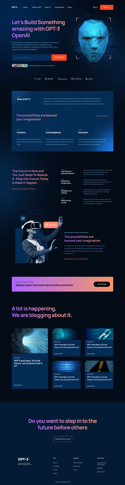

# GPT3 


<h4 align="center">
    Esse é um projeto de desafio, para agregar conhecimento em layouts mais complexos.
    O layout e os créditos do mesmo estão abaixo
</h4>

## :art: Layout
[AR Shakir](https://www.arshakir.com/)


## :hammer_and_wrench: Techs 

#### [ReactJS](https://reactjs.org/)
#### [React Icons](https://react-icons.github.io/react-icons/) 


## Metodologies
[x] CSS Modules
[x] Flex and Grid Layout
[x] Responsive

## :desktop_computer: How to use
##### 

Rode no Terminal
```
    yarn start
```